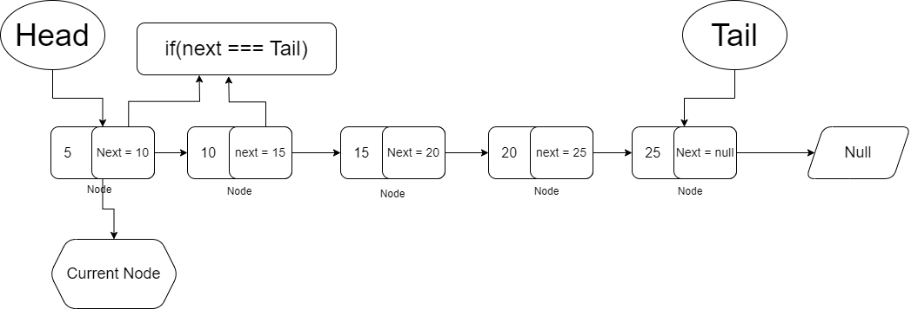

<h1>Welcome To Learn Linked List</h1>

Here is the all chapter that we will learn in this docs

<ul>
<li>লিস্টের প্রথম দিকে Node যুক্ত করা</li>
<li>লিস্টের শেষের দিকে Node যুক্ত করা</li>
<li>লিস্টের প্রথম দিক থেকে Node delete করা</li>
<li>লিস্টের শেষের দিক থেকে Node delete করা</li>
</ul>

</br>
<h2>What is Linked List?</h2>
> ডেটা স্টোর করার জন্য অ্যারের মত আরেকটি ডেটা স্ট্যাকচার হচ্ছে Linked List। এটি স্ট্র্যাকচার অনুযায়ী ডাটা স্টোর করে, এবং রান টাইমে নতুন স্পেসের দরকার হলে অটোমেটিকেলি তা তৈরি করে নিতে পারে।  এটি হচ্ছে ডাইনামিক ডেটা স্ট্রাকচার।

এটি অ্যারের মতই, তবে অ্যারেতে আমাদের কতটুকু মেমরি দরকার, প্রথমেই বলে দিতে হয়। কিন্তু লিঙ্কড লিস্টে প্রয়োজন অনুযায়ী মেমরি বাড়ানো বা কমিয়ে নেওয়া যায়। আরো দুইটা সুবিধে হচ্ছে, লিঙ্কড লিস্টের মাঝখান থেকে এর যে কোন আইটেম রিমুভ করা যায় বা মাঝখানে নতুন আইটেম যুক্ত করা যায়। আর ইনিশালি কোন সাইজ ডিক্লেয়ার করে দিতে হয় না।

অসুবিধেও রয়েছে। অ্যারে রেন্ডম এক্সেস করা যায়, কিন্তু লিঙ্কড লিস্টে রেডম এক্সেস করা যায় না।

লিঙ্কড লিস্ট হচ্ছে ডাইন্যামিক্যালই এলোকেটেড নোড। প্রত্যেকটা নোডের একটা ভ্যালু এবং একটা পয়েন্টার থাকে। পয়েন্টার এর পরবর্তি নোড বা লিঙ্কড লিস্টের পরবর্তি মেম্বারকে পয়েন্ট করে। এটা ট্রেনের মত। প্রথম মেম্বার হচ্ছে ট্রেনের ইঞ্জিন। এবং এরপরবর্তী বগিটি ইঞ্জিনের সাথে কানেকটেড থাকে, যা পয়েন্টার। পরের বগিটি এর পরের বগিটির সাথে কানেকটেড থাকে। যদি শেষে কোন বগি না থাকে, তখন আমরা বলি ট্রেনের শেষ। একই ভাবে লিঙ্কড লিস্টের পয়েন্টার যদি শূন্য হয়, তাহলে আমরা বলি এর পর আর কোন মেম্বার নেই। লিঙ্কড লিস্টে প্রথম নোড অনেক গুরুত্বপূর্ন, কারণ এটাতে পরবর্তী মেম্বারের পয়েন্টার থাকে। যদি প্রথম মেম্বার কোন ক্রমে রিমুভ হয়ে যায়, তাহলে পুরো লিঙ্কড লিস্টিই আর খুঁজে পাওয়া যাবে না। ট্রেনের ইঞ্জিন ছাড়া অন্য বগি গুলো যেমন কোন কাজে আসে না।

নিচের ছবিটি লক্ষ করুন,


</br>
এটি হচ্ছে লিঙ্কড লিস্টের একটি নোড। নোডের দুইটা অংশ, একটা হচ্ছে ডেটা। আরেকটা হচ্ছে এড্রেস। এমন অনেক গুলো নোড নিয়েই লিঙ্কড লিস্ট তৈরি।  প্রথম নোডের Address দ্বিতীয় নোডের এড্রেস পয়েন্ট করা থাকে। নিচের ছবিটির মতঃ

</br>


</br>
এভাবে যত ইচ্ছে তত গুলো নোড যুক্ত করা যায়।

ট্রেনের এক একটা আলাদা ব্লককে আমরা বলি বগি, লিঙ্কড লিস্টে আমরা বলব নোড।

<h4>Linked List দুই ধরণের। নিচে দেওয়া হলঃ</h4>

<ul>
    <li>Singly Linked List</li>
    <li>Doubly Linked List</li>
</ul>

</br>

<h2>Singly Linked List</h2>
> Singly Linked List এ আমরা head এবং tail নামক ২টি জিনিস পাই, যেটা দিয়ে আমরা বুঝতে পারবো যে আমাদের কোন এলিমেন্ট head এবং কোন এলিমেন্ট tail আর head এর মানে হচ্ছে সবার প্রথম সংখ্যা এবং tail এর মানে হচ্ছে সবার শেষের সংখ্যা। এরপর Singly Linked List এ আমরা next নামে ও একটি জিনিস পাই যেটা দ্বারা আমরা জানতে পারি যে আমাদের current এলিমেন্টের পরে কোন এলিমেন্ট রয়েছে। 
আচ্ছা বুঝতে না পারলে সমস্যা নয়, নিচের ছবিটি দেখেন এবং ওই ছবি থেকে আমরা আরো বিস্তারিত আলোচনা করবো নিচে।

</br>


</br>
উপরের ছবিটি লক্ষ করলে দেখবেন যে একদম প্রথমে head রয়েছে এবং একদম শেষে tail রয়েছে এবং মাঝখানে length রয়েছে। এবং নিচের যে arrow চিহ্ন দিয়ে next next দেখানো হয়েছে ওটা হচ্ছে এড্রেস এবং সেখানে আমরা দেখতে পারবো যে আমাদের এই এলিমেন্টের পরে next কোন এলিমেন্ট রয়েছে। আর এভাবে আমাদের Singly Linked List চলতে থাকবে এবং সবার শেষে মানে tail এ যে থাকবে তার কোনো next value থাকবে না মানে ওই এলিমেন্টের next value null থাকবে।

</br>
<h2>Singly Linked List - delete last node using <b>POP</b> method</h2>

</br>


</br>

উপরের ছবিটিতে দেখা যাচ্ছে যে একটি head এবং একটি tail রয়েছে ( আগে যেভাবে বলেছিলাম ) তারপর আমাদের node গুলো রয়েছে এবং বলেছিলাম যে প্রত্যেকটি node এর সাথে next নামে একটা প্রপার্টি থাকে যার মাধ্যমে আমরা জানতে পারি যে আমাদের এই node এর পরবর্তী node কোনটি অথবা তার value কত? তাহলে এইবার আমরা চাচ্ছি যে আমাদের এই singly linked list থেকে সবার শেষে যে এলিমেন্টটি থাকবে থাকে ডিলিট করবো, তাহলে আপনারা বলতে পারেন যে আমরা তো সেটি পেয়ে যাচ্ছি যদি আমরা tail কে ধরি তাহলেই। না, Linked List এ এইভাবে করা যায় না। কারণ Linked List এ আমরা একটি এলিমেন্ট থেকে পরের এলিমেন্টে যেতে হলে পয়েন্টার ব্যবহার করে যেতে হয় যেটা আমরা Linked List এর সব Node এর মধ্যে পেয়ে থাকি ( next যেটা ওইটাই )। তাহলে আমরা যদি POP মেথডের সাহায্যে কোনো node ডিলিট করতে চাই তাহলে, উপরের Diagram এ দেয়া আছে সেভাবে ফলো করবো। প্রথমে আমাদের প্রথম যে node আছে সেটাকে currentNode নামে একটি variable এ রাখবো এবং আমরা চেক করবো যে আমাদের এই currentNode এর ভিতরে next নামে যে প্রপার্টি রয়েছে সেটা কি আমাদের পুরো Linked List এর যে Tail রয়েছে সেটার সমান? যদি সমান হয় তাহলে তো আমরা লাস্ট node টি পেয়ে গেলাম আর যদি সমান না হয় তাহলে আমরা ওই currentNode এর nextNode যেটা আছে ওইটাকে currentNode বানিয়ে দিবো এবং আবার সেইম প্রসেসে চেক করবো যে এই currentNode এর nextNode কি আমাদের tail এর সমান? এভাবে চেক করে করে আমরা পুরো node দেখবো এবং যেখানে গিয়ে আমরা tail এর সমান পাবো ( অর্থাৎ, if(next === tail) সত্যি হলে ) আমরা ওই node টাকে delete করে দিবো এবং আমাদের tail কে নিয়ে আসবো আমরা যে currentNode পেয়েছি ওইটায়, মানে এখন tail হচ্ছে ওই currentNode। এবং সর্বশেষ যখন আমাদের list এ কোনো node থাকবে না তখন আমরা আমাদের head এবং tail করে দিবো null কে ( মানে শুরুতে যেভাবে ছিলো সেভাবে )।

> যদি code দেখে বুঝতে চান তাহলে এই রিপোজিটরিতে <b>Singly List List</b> ফোল্ডারের মধ্যে পাবেন সব কোড।

</br>
<h2>Singly Linked List - delete first node using <b>SHIFT</b> method</h2>
> এবার আমরা চাচ্ছি যে আমাদের লিস্টের মধ্যে থাকা সব node থেকে সবার প্রথমে যেটা থাকবে সেটাকে delete করে দিবো যখন Shift() মেথডটি call করবো তখন। এবং এই কাজটি অনেক সহজ। আমরা প্রথমে চেক করে নিবো যে আমাদের লিস্টটি কি একেবারে খালি নাকি যদি খালি থাকে তাহলে আমরা null রিটার্ন করবো নাহলে আমাদের delete এর করবো। তো delete করার জন্য আমাদের প্রথমে একটি variable নিতে আমাদের যে head রয়েছে সেটাকে currentNode নামক একটি variable এ রাখবো। তারপর আমরা আমাদের লিস্টের যে tail রয়েছে তার সমান currentNode এর next বসিয়ে দিবো ( this.tail = currentNode.next এভাবে )। তাহলেই তো আমাদের delete করা সম্পূর্ণ। এরপর আমরা আমাদের লিস্টের length কমিয়ে দিবো, কারণ একটি node delete হয়ে গেলে তো আমাদের একটি length কমাতে হবে তাই। এরপর আমরা আরেকটা চেক করবো যে যদি আমাদের length === 0 হয় তাহলে tail যেন null হয়ে যায়। কারণ head null হয়ে যাবে shift() call করার মাধ্যমে কিন্তু দেখা যাবে যে আমাদের tail এ value রয়ে গেছে তার কারণে আমরা এটা করবো যে যখন length 0 হয়ে যাবে তখন tail এর value null হয়ে যাবে এবং tail এর next ও null হয়ে যাবে। এককথায় সব কিছু null থাকবে যদি length 0 হয়ে যায়।

> reference এর জন্য নিচে কোড দিয়ে দিলাম কিভাবে shift method implement করা যায়।

```js
// shift method
shift() {
    // চেক করা হচ্ছে যে আমাদের লিস্ট খালি কি না।
    if (!this.isEmpty()) {
      // currentNode নামক একটি variable এ আমাদের লিস্টের head কে রাখা হচ্ছে।
      let currentNode = this.head;

      // এবার delete করা হচ্ছে জাস্ট আমাদের লিস্টের head কে currentNode এর next বানিয়ে দেওয়া হচ্ছে।
      this.head = currentNode.next;

      // এবার লিস্টের length কমানো হচ্ছে।
      this.length--;

      // চেক করা হচ্ছে যে যদি লিস্টের length 0 হয় তাহলে tail যেনো null হয়ে যায়।
      if (this.length === 0) {
        this.tail = null;
      }

      // সবার শেষে currentNode return করা হচ্ছে।
      return currentNode;
    }
  }
```

</br>
<h2>Singly Linked List - Add the node in the first position of the list using the <b>UNSHIFT</b> method</h2>
> প্রথমে তো আমরা আমাদের লিস্টে node যুক্ত করেছিলাম লাস্টের দিক দিয়ে যেভাবে কোনো array তে push() method ব্যবহার করে করতাম। কিন্তু এখন আমরা চাচ্ছি যে যখন কোনো node যুক্ত করবো তখন সেই node যেনো আমাদের লিস্টের প্রথম দিকে যুক্ত হয় মানে array এর unshift() method যেভাবে কাজ করে ওইভাবেই। এটা করার জন্য বেশি কোনো কাজ করতে হবে না। আমরা যখন কোনো node যুক্ত করবো তখন ওই node কে আমাদের লিস্টের head বানিয়ে দিবো এবং নতুন যে node তৈরি করেছি সেই node এর next বানিয়ে দিবো আমাদের আগের head যেটা ছিলো ওইটাকে তাহলেই আমাদের node যুক্ত করা হয়ে যাবে।

> বিষয়টি হয়তো ক্লিয়ার হন নি। তাই নিচে কোড দেওয়া হলো এবং কমেন্টের মাধ্যমে বুঝানো হলো কোন লাইন কি কাজে ব্যবহার হচ্ছে।

```js
// unshift method
unshift(value) {
    // এখানে নতুন node তৈরি করা হচ্ছে। যখন unshift method call করা হবে তখন আপনি একটি value দিবেন আর ওই value দিয়েই এই নতুন node তৈরি করা হচ্ছে।
    let newNode = {
      head: value,
      next: null,
    };

    // চেক করা হচ্ছে আমাদের লিস্ট কি empty। যদি empty হয় তাহলে if এর কাজ করবে না হলে else এর কাজ করবে।
    if (this.isEmpty()) {
      // এখন আমাদের লিস্টের head যেটা রয়েছে সেটার value হিসেবে আমাদের নতুন node কে দেয়া হলো
      this.head = newNode;

      // এখন আমাদের লিস্টের tail যেটা রয়েছে সেটার value হিসেবে আমাদের নতুন node কে দেয়া হলো
      this.tail = newNode;
    } else {
      // আমাদের নতুন node যখন তৈরি করেছিলাম তখন নতুন node এর next কে null রেখেছিলাম তাই এখন ওই নতুন node এর next এর value হিসেবে আমাদের আগের head কে দিয়ে দিচ্ছি।
      newNode.next = this.head;

      // এখানে আমাদের লিস্টের head এর জায়গায় আমাদের নতুন node কে বসিয়ে দিচ্ছি।
      this.head = newNode;

      // এবার একটি node যুক্ত হলে তো আমাদের লিস্টের length ও বৃদ্ধি করতে হবে সেটাই এখানে করা হচ্ছে।
      this.length++;
    }
  }

```

</br>
<h2>Dubbly Linked List</h2>


</br>
> উপরের ছবিটি লক্ষ করুন, dubbly linked list এর সবকিছু সেইম singly linked list এর মতো, শুধু পরিবর্তনটি হচ্ছে singly linked list এ আমরা previous নামে কোনো জিনিস পেতাম না কিন্তু dubbly linked list এ আমরা previous নামে একটা property পাচ্ছি যেটার মাধ্যমে আমাদের currentNode এর আগের node কোনটি সেটা জানতে পারবো। তাছাড়া বাকি সব singly linked list এর মতো।
